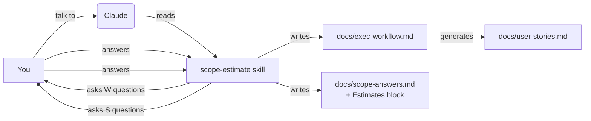
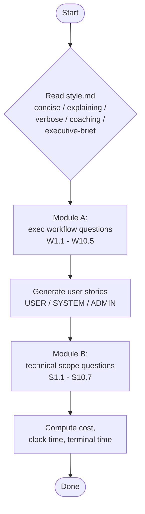
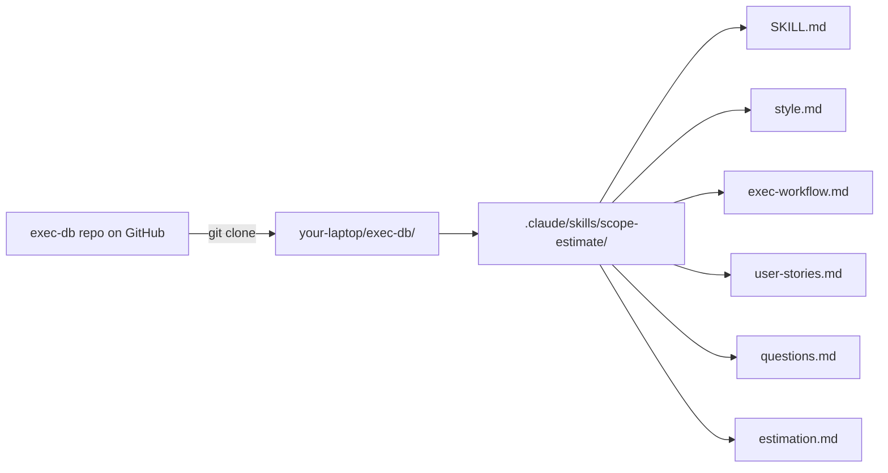
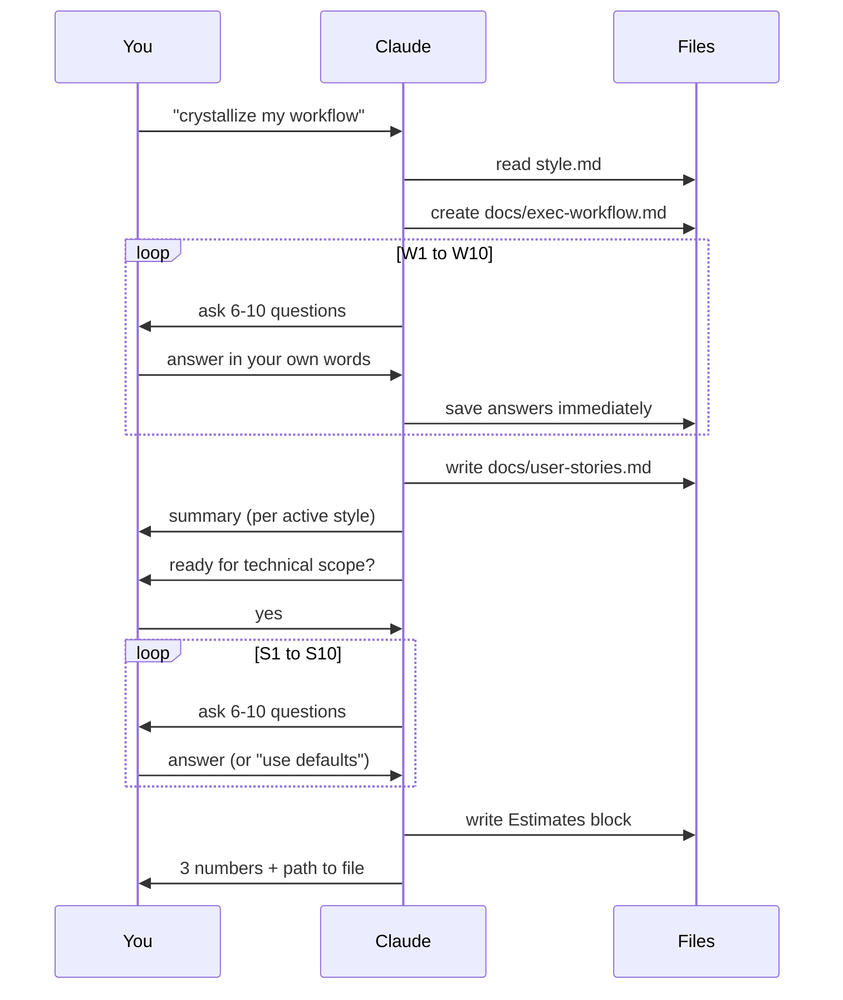
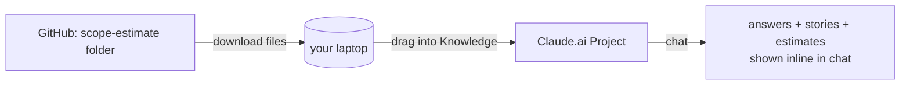
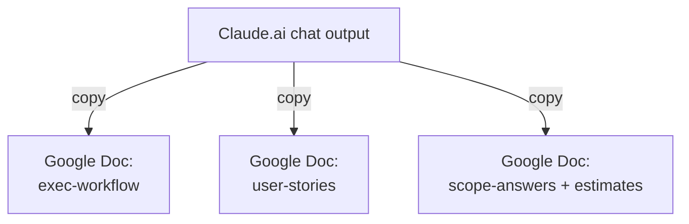

# How to use this skill (non-technical guide)

This guide is for executives, operators, and PMs — no terminal experience
assumed. You will end up with three files on your laptop:

- `docs/exec-workflow.md` — your workflow in your own words
- `docs/user-stories.md` — USER / SYSTEM / ADMIN stories generated for you
- `docs/scope-answers.md` — scope decisions and a cost / time estimate

Pick **one** of the two paths below. Path 1 (Claude Code) is the smoother
experience. Path 2 (Claude.ai web) needs no install.

---

## Big picture



The skill runs in two ordered modules:



---

## Path 1 — Claude Code on your laptop

Best when you want this to be repeatable and live next to your project.

### Step 1. Install Claude Code (one time, ~5 min)

1. Open <https://claude.com/claude-code> and follow the install button
   for your operating system (Mac, Windows, or Linux).
2. When it asks you to log in, log in with your Anthropic account.
3. Open the **Terminal** app (Mac: ⌘+Space, type "Terminal"; Windows:
   Start menu → "Windows Terminal").

### Step 2. Get the skill onto your laptop

You have two options.

**Option A — clone the whole exec-db repo (recommended).**

In Terminal, paste:

```bash
git clone https://github.com/haremantra/exec-db.git
cd exec-db
```

The skill is already inside at `.claude/skills/scope-estimate/`.

**Option B — copy just the skill folder.**

If you have a different project you want this skill in, copy the
`scope-estimate` folder into that project at the path
`.claude/skills/scope-estimate/`. Create the `.claude/skills/` folders
if they do not exist.



### Step 3. Set the conversation style (optional)

Open `.claude/skills/scope-estimate/style.md` in any text editor.
Find the line:

```
active_style: concise
```

Change `concise` to one of: `explaining`, `verbose`, `coaching`,
`executive-brief`. Save and close. That's it — the skill will use that
style every time.

You can also override per session by saying
*"use coaching style"* in the Claude conversation.

### Step 4. Run the skill

Inside the project folder, in Terminal, type:

```bash
claude
```

You'll see a prompt. Type any of these:

- `crystallize my workflow and give me user stories`
- `run the exec interview`
- `scope and estimate the build`

Claude will detect the skill and start asking the workflow questions
in batches.



### Step 5. Read your outputs

Open these files in any text editor (or in VS Code, or just preview
them on GitHub):

- `docs/exec-workflow.md` — the interview transcript, structured.
- `docs/user-stories.md` — your stories, grouped by USER / SYSTEM /
  ADMIN, with priorities and acceptance criteria.
- `docs/scope-answers.md` — scope decisions plus the **Estimates**
  block at the bottom (cost, clock-time weeks, terminal-time hours,
  top cost drivers, easiest deferrals).

---

## Path 2 — Claude.ai web (no install)

Best when you just want to try it once without setting anything up.

### Step 1. Open Claude.ai and start a Project

1. Go to <https://claude.ai>.
2. In the left sidebar click **Projects** → **+ Create Project**.
3. Name it "exec-db scoping".

### Step 2. Upload the skill files into the Project

Download the six skill files from GitHub:

<https://github.com/haremantra/exec-db/tree/main/.claude/skills/scope-estimate>

Click each file → **Raw** → save. Then drag-drop these into your
Project's **Knowledge** panel:

- `SKILL.md`
- `style.md`
- `exec-workflow.md`
- `user-stories.md`
- `questions.md`
- `defaults.md`
- `estimation.md`
- `exec-workflow-template.md`
- `user-stories-template.md`
- `template.md`



### Step 3. Start the conversation

In the Project chat, paste this prompt:

> Read SKILL.md from the Project knowledge and follow it. Use
> `executive-brief` style. Run Module A first — ask me the W
> questions in batches of 6, save my answers in your reply as
> `docs/exec-workflow.md`, then generate `docs/user-stories.md` and
> show it to me. Then ask if I want to continue to Module B for the
> scope estimate.

Claude will run the workflow exactly as in Path 1, but instead of
writing files to your laptop it will print the file contents inside
the chat. **Copy-paste each generated file into your own document**
(Google Docs, Notion, Word) to keep it.

### Step 4. Save your outputs

Three files to copy out:

1. The exec-workflow file Claude prints.
2. The user-stories file Claude prints.
3. The scope-answers file (with the estimates block) Claude prints.



---

## What the questions feel like

Module A asks things like:

- "Walk through a typical Monday from the moment you open your
  laptop until lunch. What apps do you touch, in what order?"
- "What's a note you wrote in the last month that paid off later?"
- "When you say 'I'll send a follow-up,' what does that email
  usually contain?"

Answer in your own words — full sentences are fine. Quotes are
better than bullet points here, because the system uses your phrasing
to generate user stories.

Module B asks things like:

- "What is the minimum useful contact record: name/email/company/title
  only, or do you need tags, owner, stage, last-touch, next-step?"
- "Should the system ever send emails automatically, or only create
  drafts?"

If you don't know, say **"use defaults"** and the skill will pick
sensible MVP answers and mark them with `(default)` so you can
revisit later.

---

## What the estimates mean

The **Estimates** block at the bottom of `docs/scope-answers.md`
gives you three independent numbers:

| Number | What it means | Use it for |
|--------|---------------|------------|
| **Cost (USD)** | $ a senior contractor would charge to build it, plus the LLM token cost during the build itself | budget approval |
| **Clock time** | calendar weeks if 1 senior full-stack dev builds it at 30 productive hours/week | hiring + planning |
| **Terminal time** | wall-clock hours of an autonomous coding agent (Claude Code in headless mode) building it, plus ~10% human review hours, plus token spend for the agent run | "what if a robot built it" comparison |

All three are ranges (low–high), not point estimates. Treat them as
planning aids, not contracts.

---

## Common questions

**Do I need to know how to code?**
No. Path 2 (Claude.ai web) needs zero technical setup. Path 1
needs you to install one app and copy-paste two commands.

**Can I stop halfway and come back later?**
Yes. Answers are saved immediately after each batch. Re-run the
skill and it picks up where you left off.

**Can I change my answers?**
Yes. Open `docs/exec-workflow.md` or `docs/scope-answers.md` in any
editor, change the line, save, and rerun the skill — it regenerates
the user stories and the estimates.

**Who sees my answers?**
Only you. The files live on your laptop (Path 1) or in your private
Claude.ai Project (Path 2). Nothing is published unless you commit
and push it to a Git repo yourself.

**The questions feel long. Can I skip some?**
Yes. Type "skip W3.4" or "skip section E" and the skill will leave
those as `_unanswered_`. They show up in the **Unblockers** section
of `docs/user-stories.md` so you don't lose track.
